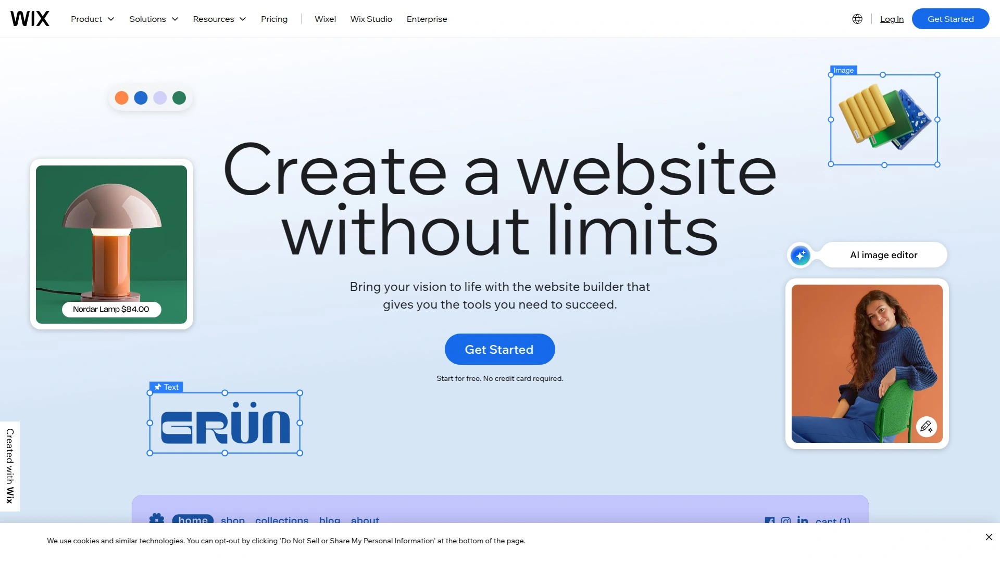

# 2025年排名前10的网站构建平台汇总（最新整理）

在当前数字化浪潮中，企业和个人都需要一款高效的**网站构建平台**来快速搭建网站并覆盖全渠道数字营销需求。
本文挑选了10款领先的**数字营销工具**和建站平台，对比功能、易用性和成本，以助您在短时间内实现在线业务增长。

## [Builderall](https://builderall.com)
一站式数字营销与网站构建平台，提供包括网站建设、电子邮件营销、销售漏斗等全套工具，适合中小企业一体化运营需求。

- 核心功能与特色：
  - 拖放式网站构建器（Cheetah Drag and Drop Builder），无需编码即可设计响应式页面。
  - Magic Text AI 智能内容工具，可在构建页面和邮件中自动生成文案。
  - 内置电子邮件营销系统、聊天机器人和在线研讨会管理功能。
  - 一体化营销漏斗与会员网站系统，支持支付、预约和统计分析。
- 适用场景与推荐理由：适合需要高性价比、一站式搭建和自动化运营的创业者与小型团队。

## [ClickFunnels](https://www.clickfunnels.com)
专注于销售漏斗搭建，提供丰富模板和自动化营销流程，助力快速转化访客为客户。

- 核心功能：多种漏斗类型、一键支付集成、A/B 测试工具。
- 目标用户：聚焦电商和在线销售型企业，追求高转化的营销团队。

## [Kartra](https://www.kartra.com)
集成网站构建、邮件自动化和会员系统，支持课程发布与订阅制内容运营。

- 特色卖点：一体化 CRM、视频宿主及自动跟进系统，降低多平台切换成本。
- 上手难度：界面直观，适合技术基础一般的营销人员。

## [Kajabi](https://www.kajabi.com)
以在线课程和会员站点为核心，集成网页设计、电子邮件和社区功能。

- 亮点功能：课程发布模板、社区互动模块、付费墙设置。
- 使用场景：教育工作者与内容创作者的理想之选。

## [GrooveFunnels](https://www.groovefunnels.com)
提供免费入门套餐，含网页、漏斗、邮件和会员功能，增值模块按需解锁。

- 技术优势：原生视频宿主、弹窗及表单多样化。
- 成本考量：基础功能免费，高级版按功能打包。

## [Systeme.io](https://systeme.io)
轻量级一体化营销平台，涵盖网站、邮件、漏斗与会员区，支持订阅与支付链接。

- 适用场景：预算有限但需求全覆盖的小型企业和个人创业者。
- 上手速度：几分钟即可完成基础站点和简易漏斗搭建。

## [GetResponse](https://www.getresponse.com)
主打邮件营销与营销自动化，附带登录页与简易网站构建功能，为邮件增长和转化保驾护航。

- 功能特色：邮件自动化工作流、事件营销、客户分层管理。
- 场景推荐：注重邮件投放效果和潜在客户培养的运营团队。

## [Wix](https://www.wix.com)
以模板和拖拽设计著称，支持网页、在线商店和博客，多数功能无需编程经验。

- 用户友好：海量模板库与市场插件助力快速上线。
- 目标人群：设计导向型小微工商户与个人创作者。

## [Squarespace](https://www.squarespace.com)
高端风格模板与集成托管，适合注重品牌形象的企业和创意人士。

- 设计优势：出色的视觉编辑器和内置图库。
- 成本结构：月付或年付方案，含域名和SSL。

## [Shopify](https://www.shopify.com)
电商专用建站平台，支持多渠道销售、支付网关和库存管理，全球商家首选。

- 核心功能：完善的产品目录、订单处理和物流接入。
- 推荐理由：高稳定性和扩展性，适合快速成长的电商项目。

***

## FAQ

**问：如何选择最适合我的网站构建平台？**
可根据业务类型、预算和核心需求对比站点构建、营销自动化及电商支持功能，加以试用后决策。

**问：新手如何快速上手并部署网站？**
建议优先体验拖拽式编辑、模板和向导式设置流程，利用平台自带教程和社区支持加速学习。

**问：如何评估建站平台的成本效益？**
关注基础套餐覆盖功能、付费模块价格及后期扩展费用，对比月/年付成本与预期收益。

***

总结：以上10款平台从多维度满足不同场景的建站与数字营销需求，其中**第 1 名适合需要一站式营销与快速上线的中小企业**——[Builderall](https://builderall.com)。
