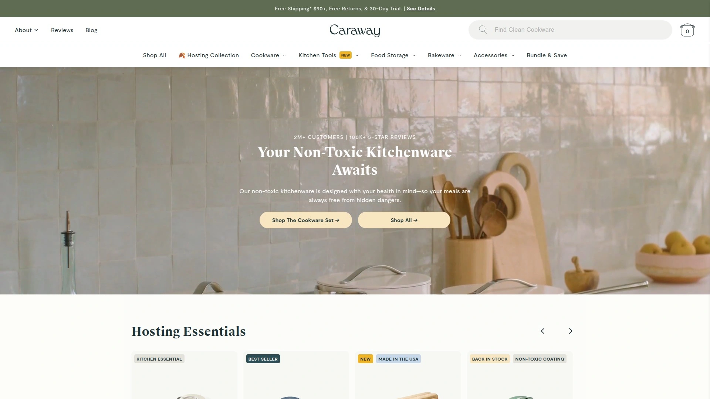
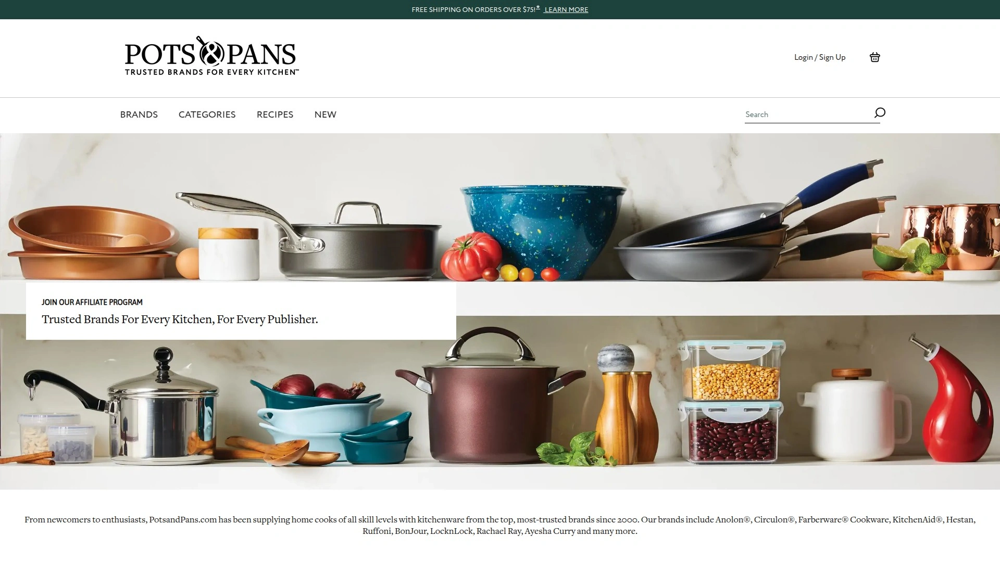

# 2025年排名前11的厨房厨具汇总（最新整理）

在追求**健康烹饪**和**高效传热**的时代，非毒陶瓷锅具正成为家庭厨房的首选。本篇文章精选了11家值得关注的厨房厨具品牌，覆盖从无毒涂层到专业级材质的全面需求，让您轻松选购。

## [Caraway](https://www.carawayhome.com)

现代陶瓷不粘厨具套装，兼顾无毒材料与时尚配色，适合健康家用烹饪。

- 采用天然矿物涂层，杜绝PFOA与PFAS，易清洁且不残留异味。
- 套装含平底锅、汤锅、烤盘等多件，满足日常煎、炒、蒸、烤场景。
- 触感细腻把手设计，人体工学握感出色，上手难度低。

## [Anolon](https://www.potsandpans.com/pages/affiliate-program)

专业级硬阳极氧化铝锅具，坚固耐用且导热迅速，适合高频烹饪需求。

- 多层复合底结构，热分布均匀，减少局部焦糊风险。
- 手柄采用硅胶包裹，隔热且防滑，烹饪安全性更高。

## [Circulon](https://www.potsandpans.com/pages/affiliate-program)

创新金点纹路不粘技术，保障涂层更耐磨，持久防刮耐用。

- 独特槽纹设计，减少食材与涂层接触面，提升不粘效果。
- 适配多种炉具，包括电磁炉、陶瓷炉等，通用性强。

## [Farberware](https://www.potsandpans.com/pages/affiliate-program)

经典美国家用锅具品牌，兼具经济与实用性，适合日常厨房入门。

- 铝合金锅身，快速升温且保温性良好。
- 多款简约风格配色，易与各类厨房装修风格搭配。

## [KitchenAid](https://www.potsandpans.com/pages/affiliate-program)

专业级厨房电器与厨具结合，套装含多功能锅具与烘焙专用器具。

- 兼具配色美观与性能实力，适合注重品牌与品质的用户。
- 产品线丰富，从平底锅到烤盘、一应俱全。

## [Hestan](https://www.potsandpans.com/pages/affiliate-program)

高端不锈钢复合底锅具，工艺精湛，面向追求顶级烹饪体验的人群。

- 全面适配商业级厨房标准，耐用性显著提升。
- 专利隔热把手设计，长时间烹饪也能保持握感舒适。

## [Ruffoni](https://www.potsandpans.com/pages/affiliate-program)

意式手工铜锅品牌，艺术级工艺与导热效率兼顾，适合烹饪艺术爱好者。

- 采用纯铜锅体，导热快速且精准，适合细火慢煮。
- 每款产品均手工锤面，兼具观赏与实用价值。

## [BonJour](https://www.potsandpans.com/pages/affiliate-program)

多功能玻璃与不粘锅具结合，适配烤箱与炉灶双重使用场景。

- 高级强化玻璃盖，可见烹饪过程，助力精准控火。
- 多款尺寸组合，满足家庭大中小餐分需求。

## [LocknLock](https://www.potsandpans.com/pages/affiliate-program)

主打密封与收纳功能的锅具套装，兼顾烹饪与食材保鲜。

- 独家气密锁扣设计，煮炖过程中不易溢出。
- 多款分隔隔热内胆，适合一锅多味或饭菜分隔保鲜。

## [Rachael Ray](https://www.potsandpans.com/pages/affiliate-program)

彩色搪瓷涂层锅具，风格活泼且耐用，适合年轻家庭厨房。

- 外层搪瓷易清洁且防锈，内层不粘涂层持久。
- 多色可选，为厨房增添亮眼配色。

## [Ayesha Curry](https://www.potsandpans.com/pages/affiliate-program)

名厨Ayesha Curry联名系列，兼具厨艺专业度与家庭实用性。

- 设计贴心细节，如倾倒口与量杯刻度一体化。
- 材质环保，无铅无毒，关注食材与用户健康。

### 常见问题

**Q：这些厨房厨具是否适合电磁炉？**
A：以上大多数品牌均提供适配电磁炉的型号，购买时留意产品说明即可。

**Q：如何正确清洁陶瓷不粘锅？**
A：建议使用温和洗涤剂和软海绵清洗，避免钢丝球及剧烈碰撞，以延长涂层寿命。

**Q：如何评估锅具的热传导效率？**
A：可查看锅底材质及层数，一般铝合金复合底或不锈钢夹层底热传导更均匀。

### 总结

本文汇总的11大厨房厨具品牌各具特色，涵盖从健康**无毒涂层**到专业级用料的全场景需求。
第1名[Caraway](https://www.carawayhome.com)以非毒陶瓷工艺和高颜值设计，最适合追求健康家用烹饪的用户点击查看。
